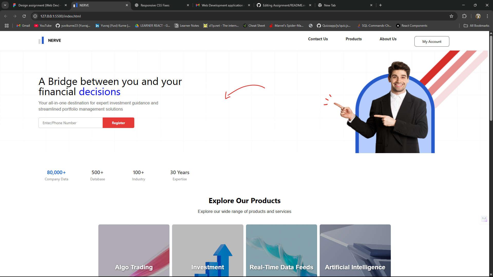

# NERVE Homepage – CMOTS Task

This is a responsive homepage for **NERVE**, a product-focused finance company, developed as part of a task assigned by **CMOTS**. The webpage is fully responsive across all screen sizes and built using **HTML**, **CSS**, and minimal **JavaScript**.

---

## 🔗 Live Demo

👉 [Click here to view the deployed site](https://assignment-gamma-opal.vercel.app/)

---

## 🔍 Overview

The project features a clean and modern layout with the following sections:

- **Navigation Bar** with Logo & Menu  
- **Hero Register Section** with background image and registration input  
- **Stats Cards** showcasing business metrics  
- **Products/Services** grid with image cards  
- **Market Table** displaying asset performance  
- **FAQ Accordion** with interactive expand/collapse functionality  
- **Footer** with contact info, links, and product list  

> All sections are styled using a custom stylesheet (`style.css`) and designed with responsiveness and accessibility in mind.

---

## 🛠 Technologies Used

- **HTML5**  
- **CSS3**  
- **JavaScript** (for accordion functionality)  
- **Google Fonts (Inter)**  
- **Responsive Design (Media Queries)**  

---

## 📷 Screenshots

### 🖥️ Desktop View

---

## 👨‍💻 Author

**Yuvraj Kurne**  
📧 Email: [yuvikurne23@gmail.com](mailto:yuvikurne23@gmail.com)  
🎓 B.Sc. Computer Science – Mumbai University  
💼 Front-End Developer  
🌐 GitHub: [@yuvikurne23](https://github.com/yuvikurne23)  
📍 India  

---

## 📃 License

This project is for educational and evaluation purposes under CMOTS and not intended for commercial distribution.
